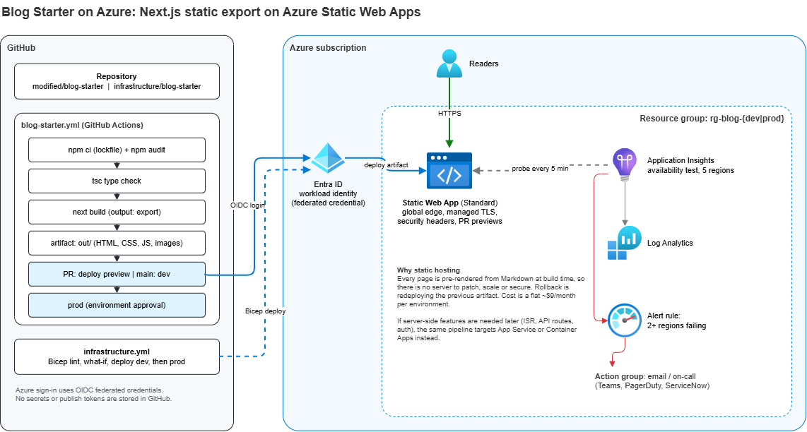
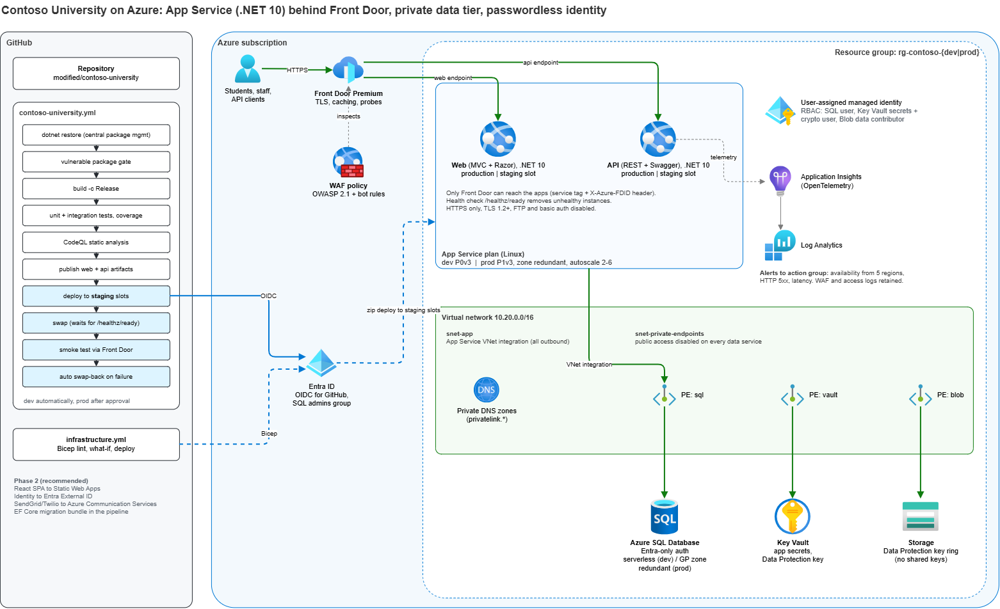

# Cloud Assessment: Deploying and Modernizing Two Applications on Azure

**Candidate:** Glen Souza
**Role:** Senior Cloud Operations Developer, AVEVA
**Date:** October 2026

---

## Purpose of this repository

The assessment asks two questions about two public applications:

1. **How would you deploy** the [Next.js Blog Starter](https://github.com/vercel/next.js/tree/canary/examples/blog-starter) to AWS or Azure?
2. **How would you adapt** the legacy [Contoso University](https://github.com/alimon808/contoso-university) ASP.NET Core application to AWS or Azure?

Each question asks for an architecture diagram and a description of the build pipeline. The second also asks which code updates I would recommend.

Instead of answering only in writing, I did the work. This repository holds:

- the **original** source of both applications, unchanged, for reference;
- a **modified** copy of each with the changes I recommend already made, building and passing tests;
- **Infrastructure as Code** (Bicep) for every Azure resource described below, plus a step-by-step guide for both the Azure Portal and the Azure CLI;
- **GitHub Actions pipelines** that build, test, scan and deploy each application, and deploy the infrastructure;
- **architecture diagrams** as `.drawio.png` files: images that render on GitHub and also open as editable diagrams in draw.io.

Comparing `original/` with `modified/` shows exactly what changed and why, the same way a pull request would in a real modernization project.

I chose **Azure** for both answers. The role is Azure-focused, and my background is mostly Azure (Microsoft Certified DevOps Engineer Expert, Azure Developer, and Azure Administrator, among others). Each answer ends with the equivalent AWS design.

## Repository layout

```text
.
├── README.md                          this document: the answers
├── diagrams/                          architecture diagrams (.drawio.png: image + editable diagram)
├── original/
│   ├── blog-starter/                  vercel/next.js examples/blog-starter, as published
│   └── contoso-university/            alimon808/contoso-university, as published
├── modified/
│   ├── blog-starter/                  configured for static export to Azure Static Web Apps
│   └── contoso-university/            upgraded to .NET 10, cloud-ready, defects fixed
├── infrastructure/
│   ├── README.md                      setup guide: Portal and az CLI, including installing the CLI
│   ├── blog-starter/                  Bicep for the blog
│   └── contoso-university/            Bicep for Contoso (modules for network, data, web, Front Door, monitoring)
├── .github/dependabot.yml             weekly dependency updates for modified/ and the workflows
└── .github/workflows/
    ├── infrastructure.yml             runs when infrastructure/ changes: lint, what-if, deploy
    ├── blog-starter.yml               build, audit, PR previews, dev, prod
    ├── contoso-university.yml         build, test, CodeQL, dev, prod
    └── contoso-university-deploy.yml  reusable deploy: staging slot, swap, smoke test, rollback
```

---

## Question 1: How would you deploy the Blog Starter to Azure?

### Short answer

Build it as a **fully static site** with `next build` (`output: "export"`) and host it on **Azure Static Web Apps (Standard)**. A GitHub Actions pipeline builds once, gives every pull request its own preview URL, deploys to dev automatically and to production after an approval. It signs in to Azure with OIDC, so no deployment secrets are stored anywhere. Application Insights checks the site from five regions and alerts the on-call channel if it goes down.

### What the application actually needs

Before picking a service, I looked at what the app does at runtime:

- Every page is generated at **build time** from Markdown files in `_posts/` (`generateStaticParams` for posts, static rendering for the home page).
- It has no API routes, no server actions, no database, no authentication and no environment-specific secrets.
- The only server-side feature it touches is `next/image` optimization, which is easy to turn off because the images are already sized for the layout.

So the output of the build is a folder of HTML, CSS, JavaScript and images. **There is nothing to run on a server.**

### Options considered

| Option | Verdict |
|---|---|
| **Azure Static Web Apps (Standard)** | **Chosen.** Global edge distribution, free managed TLS, custom domains, built-in PR preview environments, security headers from a config file, SLA on Standard. About $9 per month. No servers to patch. |
| Storage static website + Azure Front Door | Works well and adds WAF, but costs more (Front Door base fee) and has no preview environments. A good choice if the company standard requires Front Door in front of everything. |
| App Service (Node.js) running `next start` | Needed only for server-side rendering, ISR or API routes. Adds an OS and runtime to patch and scale, with no benefit for this app. |
| Azure Container Apps | Same as App Service but containerized. Right for a Next.js app with real server workloads, too much for static pages. |

If the blog later needs server features, the same pipeline can target App Service or Container Apps. Only the deploy step changes.

### Architecture



*The image contains the diagram source: open [`diagrams/blog-starter-azure.drawio.png`](diagrams/blog-starter-azure.drawio.png) in draw.io (desktop, VS Code extension or app.diagrams.net) to edit it.*

| Component | Purpose |
|---|---|
| Azure Static Web Apps (Standard) | Serves the exported site from Microsoft's global edge network. Managed TLS certificates, custom domain, HTTP/2, compression. |
| `staticwebapp.config.json` | Security headers (HSTS, CSP, X-Frame-Options, Referrer-Policy, Permissions-Policy), long-lived cache headers for hashed assets, custom 404. |
| Preview environments | Each pull request gets its own URL. Reviewers see the change running before it merges, and the environment is deleted when the PR closes. |
| Application Insights + availability test | Requests the home page every 5 minutes from 5 regions and checks the status code and that the TLS certificate has at least 14 days left. |
| Alert rule + action group | Fires when 2 or more regions fail. Emails the operations address; can also page through Teams, PagerDuty or ServiceNow. |
| Log Analytics | Central store for telemetry, shared with other workloads. |
| Microsoft Entra ID (workload identity federation) | Lets GitHub Actions sign in to Azure with short-lived OIDC tokens, scoped to this repository and its `dev` and `prod` environments. |

### Code changes (in [`modified/blog-starter`](modified/blog-starter))

| Change | Why |
|---|---|
| `next.config.ts`: `output: "export"`, `trailingSlash: true`, `images.unoptimized: true`, `poweredByHeader: false` | Produces a static `out/` folder with no server dependency, and URLs that map cleanly to files on Static Web Apps. |
| `package.json`: `next` pinned to `16.3.8` instead of `"latest"` | `"latest"` means two builds of the same commit can produce different code. Pinning plus `package-lock.json` and `npm ci` makes builds reproducible. Dependabot can raise version updates as reviewed PRs. |
| Added `typecheck` script and `engines.node >= 22` | Lets the pipeline fail fast on type errors and documents the supported runtime. |
| `public/staticwebapp.config.json` | Security headers, cache policy and 404 handling, versioned with the code. |
| `CoverImage` takes an `eager` flag, set on the hero post and the post header | Those covers are the Largest Contentful Paint element of their pages but were lazy-loaded, so the browser fetched them late (Next.js flags this in development). They now load with `loading="eager"` and `fetchPriority="high"`; images below the fold stay lazy. |
| `markdown-styles.module.css`: list styles for post content | Tailwind's base styles remove bullets and numbers, and the starter never restored them, so lists in posts rendered as plain lines. |
| New post: `_posts/deploying-this-blog-to-azure.md` | Proves the publishing path end to end: one Markdown file plus its images, no code changes. The post explains how the blog is built and deployed, using the architecture diagram as its cover. |

### Performance recommendations (next steps, not yet implemented)

Measured on the static export:

| Observation | Recommendation | Expected effect |
|---|---|---|
| Cover images are 2000×1000 JPEGs (44 to 118 KB) sent at full size to every device. Image optimization is off because a static export has no server to resize images. | Generate responsive AVIF/WebP variants at build time (for example with `sharp`, or the `next-image-export-optimizer` package) and serve them with `srcset` and `sizes`. | Typically 50 to 80% fewer image bytes on phones; faster LCP. |
| About 630 KB of JavaScript (before compression) for a blog whose only interactive element is the theme switcher. | Run `@next/bundle-analyzer`, keep everything except the theme switcher as Server Components, and set a JavaScript size budget in CI. | Less script to download and parse; better Interaction to Next Paint on low-end devices. |
| No automated performance check in the pipeline. | Add Lighthouse CI to `blog-starter.yml`, run against the PR preview URL, with budgets (for example LCP under 2.5 s, CLS under 0.1, performance score 90+). | Performance regressions are caught in review, not by readers. |
| Cover images use a one-day cache because their file names do not change between versions. | Add a content hash to image file names during the build so they can use the same `immutable`, one-year cache as the JavaScript and CSS. | Repeat visits load images from the browser cache. |
| Author avatars are plain `` tags. | Use `next/image` (or set `width`, `height` and `loading="lazy"`) so the browser reserves space and defers them. | Avoids layout shift; fewer requests on first paint. |
| The Open Graph image is loaded from `og-image.vercel.app`, an external service. | Generate the image at build time (`opengraph-image.tsx`) and host it with the site. | Removes a third-party dependency for link previews. |

Already in place: fonts are self-hosted by `next/font` (no request to Google at runtime), hashed JavaScript and CSS are cached for a year, and Static Web Apps serves everything from its global edge with compression.

> Note: response times shown by `npm run dev` (for example `GET / 200 in 3.7s`) include on-demand compilation in development mode. They are not representative of production, where every page is a pre-built HTML file served from the edge.

### Build pipeline ([`.github/workflows/blog-starter.yml`](.github/workflows/blog-starter.yml))

| Stage | Tools | Details |
|---|---|---|
| Trigger | GitHub Actions | Changes under `modified/blog-starter/` on a PR or on `main`. |
| Install | Node.js 22, `npm ci` | Exact versions from the lock file; npm cache keyed on the lock file. |
| Dependency audit | `npm audit --omit=dev --audit-level=high` | Fails the build on high or critical vulnerabilities in runtime dependencies. |
| Type check | TypeScript `tsc --noEmit` | Catches type errors before the build. |
| Build | `next build` (static export) | Produces `out/`; uploaded once as a build artifact. |
| PR preview | `Azure/static-web-apps-deploy` | Deploys the artifact to a preview environment and comments the URL on the PR. Removed when the PR closes. |
| Deploy dev | `azure/login` (OIDC) + `Azure/static-web-apps-deploy` | The deployment token is fetched at run time with `az staticwebapp secrets list`, masked, and never stored. Smoke test with `curl` afterwards. |
| Deploy prod | Same, in the `prod` GitHub environment | Requires an approval. Promotes the **same artifact** that was tested in dev. |
| Infrastructure | [`infrastructure.yml`](.github/workflows/infrastructure.yml) with Bicep | Lint and build on every change, `what-if` on PRs, deploy dev then prod on `main`. |

Rollback is re-running the last good workflow run, which redeploys its artifact in under a minute.

### Operations

- **Monitoring:** availability tests from 5 regions, TLS expiry check, alert to an action group.
- **Security:** HTTPS only with HSTS; strict security headers; no server, so no OS or runtime to patch; no stored credentials in CI; dependency audit on every build.
- **Cost:** about $9 per month per environment for Static Web Apps Standard, plus a few cents of Application Insights. The Free tier works for non-production if an SLA is not needed.

### The AWS equivalent

| Azure | AWS |
|---|---|
| Static Web Apps | S3 bucket (private, Origin Access Control) + CloudFront, or AWS Amplify Hosting |
| Managed certificate | AWS Certificate Manager (in `us-east-1` for CloudFront) |
| Security headers config | CloudFront response headers policy |
| PR preview environments | Amplify pull request previews |
| Application Insights availability test | CloudWatch Synthetics canary |
| Action group | CloudWatch alarm + SNS topic |
| Entra ID workload identity federation | IAM OIDC identity provider for GitHub + IAM role with a trust policy for the repository |
| Bicep | AWS CDK or CloudFormation (or Terraform on both clouds) |

The pipeline stays the same; only the login and deploy steps change (`aws-actions/configure-aws-credentials` with OIDC, then `aws s3 sync` and a CloudFront invalidation).

---

## Question 2: How would you adapt Contoso University to Azure?

### Short answer

Upgrade it from **.NET Core 2.1** (end of support August 2021) to **.NET 10 LTS**, fix the defects that block it from running on modern .NET or at scale, and make it cloud-ready: secrets from Key Vault, passwordless SQL through a managed identity, shared Data Protection keys, health checks and OpenTelemetry. Host the web app and API on **Azure App Service (Linux)** behind **Azure Front Door Premium with WAF**. Keep the data tier (**Azure SQL**, **Key Vault**, **Storage**) on **private endpoints** inside a VNet.

Deploy with GitHub Actions to a **staging slot**. Swap only after the new version reports healthy, smoke test through Front Door, and swap back automatically if the smoke test fails.

I did the upgrade in [`modified/contoso-university`](modified/contoso-university). It builds on .NET 10, and **all 158 tests pass**, including 10 integration tests that were not part of the original solution and had never run in CI.

### Why App Service and not containers

I considered Azure Container Apps and AKS, and chose App Service for this application:

- It is a .NET web app and API with no sidecars, background workers or custom OS dependencies. App Service runs .NET 10 natively, and Microsoft patches the OS and the runtime.
- Deployment slots with warm-up and swap give zero-downtime releases and one-command rollback without building that machinery myself.
- There is no image registry, base-image patching cadence or image scanning to own, so there is less for operations to maintain.
- It still has what an enterprise needs: VNet integration, private endpoints, managed identity, zone redundancy and autoscale.

If the team later splits the API into separate services or adds event-driven workers, Container Apps is the natural next step. The code changes below (configuration-driven settings, health endpoints, OpenTelemetry, no local state) make that move straightforward.

### Assessment of the legacy application

I reviewed the code before deciding how to move it. These are the issues that matter for running it in the cloud, ordered by impact. Every item marked **Fixed** has been changed in `modified/` and covered by the passing build and tests.

| # | Finding | Impact | Status |
|---|---|---|---|
| 1 | Targets **.NET Core 2.1 / ASP.NET Core 2.1 / EF Core 2.1**, all out of support since 2021. | No security patches for five years. Cannot run on current App Service runtimes. | **Fixed:** .NET 10 LTS, all packages current, central package management. |
| 2 | `services.AddScoped(typeof(IRepository<>), typeof(Repository<,>))` registers an open generic with mismatched arity. | Current .NET rejects this when the container is built, so **the app crashes at startup** after any upgrade. | **Fixed:** removed. Nothing resolved it; repositories come from `UnitOfWork`. |
| 3 | Student list sorting uses reflection on a **user-supplied property name** inside the LINQ query. | EF Core 2 quietly loaded the **whole Students table into memory** to sort it. EF Core 3+ throws, so the page returns HTTP 500. | **Fixed:** allow-listed, strongly typed sort translated to SQL `ORDER BY`. |
| 4 | `UnitOfWork` calls `Database.EnsureCreated()` in its constructor. | An extra database round trip on **every request**, plus DDL permission needed at runtime. | **Fixed:** schema creation happens once, when the staging slot starts during a deployment. |
| 5 | Department edit maps the `rowversion` through `Encoding.ASCII` and never sets it as the original value. | **Optimistic concurrency never fired.** Two people editing the same department silently overwrote each other. | **Fixed:** Base64 round trip, and the posted version is used for the concurrency check. |
| 6 | Uses **AutoMapper**. Upgrading to the last free version (14.x) triggers a high-severity advisory (GHSA-rvv3-g6hj-g44x); the fixed versions (15+) are under a commercial license. | Security finding, plus a license to evaluate, for a handful of simple mappings. | **Fixed:** replaced with explicit, compile-time-checked mapping methods. |
| 7 | `ExecuteSqlCommandAsync(string)` built from an interpolated string. | SQL injection pattern (safe today only because the value is an `int`). | **Fixed:** takes `FormattableString` and uses `ExecuteSqlInterpolatedAsync`, so values are always sent as parameters. |
| 8 | Authentication default scheme set to `"Cookies"`, which is never registered (Identity uses its own scheme). | External logins and JWT break as soon as they are configured. | **Fixed:** Identity cookie stays the default for the web app; JWT bearer is the default for the API. |
| 9 | Production exception handler commented out. | Users get raw error pages; no HSTS. | **Fixed:** exception handler (web) and RFC 7807 problem details (API), HSTS. |
| 10 | Secrets for SendGrid, Twilio, OAuth and the JWT signing key come from user secrets or app settings. | Secrets end up in app settings or pipeline variables. | **Fixed:** loaded from **Key Vault** with the managed identity when `KeyVault:Uri` is set. |
| 11 | SQL connection uses `Trusted_Connection` to LocalDB. Database provider chosen by operating system. | Not deployable as is. | **Fixed:** Azure SQL with **Entra ID managed identity** (no password), plus `EnableRetryOnFailure` for transient faults. |
| 12 | ASP.NET Core Data Protection keys stored locally per instance. | With 2+ instances, sign-in cookies and antiforgery tokens fail randomly. | **Fixed:** key ring in Blob Storage, encrypted with a Key Vault key. |
| 13 | No health checks, telemetry disabled (Application Insights commented out). | Load balancers and operators cannot tell whether the app is healthy. | **Fixed:** `/healthz/live` and `/healthz/ready` (includes database), **OpenTelemetry** to Azure Monitor. |
| 14 | No awareness of a reverse proxy. | Wrong scheme and client IP behind Front Door, so HTTPS redirects and OAuth callbacks break. | **Fixed:** forwarded headers middleware. |
| 15 | CI on Travis CI (travis-ci.org shut down in 2021); deployment by FTP and Web Deploy publish profiles. | No working pipeline; credential-based deployment. | **Fixed:** GitHub Actions with OIDC; publish profiles removed; FTP and basic auth disabled on App Service. |
| 16 | Integration test project not in the solution; Selenium 3 with a pinned ChromeDriver 2.33. | Integration tests never ran. | **Fixed:** added to the solution and passing; Selenium 4 API. |
| 17 | `Migrations/` contains only model snapshots, no migrations. The schema is created with `EnsureCreated`. | No safe way to evolve the schema in production. | **Recommended:** generate a baseline migration, run an **EF Core migration bundle** as a pipeline step, then drop `db_ddladmin` from the app identity. |
| 18 | API `PUT /departments/{id}` ignores the client's row version. | Lost updates through the API. | **Recommended:** return an `ETag`, require `If-Match`, return `412 Precondition Failed` on mismatch. |
| 19 | React SPA built on Create React App 3 (deprecated) and React 16, hosted inside an ASP.NET Core process. | Old toolchain, does not build on current Node.js without workarounds. | **Recommended:** move to Vite + React 19, host on **Static Web Apps** with the API as its backend. |
| 20 | Self-issued JWTs signed with a shared symmetric key; ASP.NET Identity with SMS 2FA through Twilio. | Key management and identity security owned by the app team. | **Recommended:** **Microsoft Entra External ID** for users, Entra ID app roles for the API, **Azure Communication Services** for email and SMS. |
| 21 | Twilio SMS call is synchronous inside an async method. | Blocks a thread per SMS. | **Recommended:** switch to the async client (or Azure Communication Services). |

I kept the existing `Startup` classes and repository pattern on purpose. The goal of the first phase is to get a supported, secure, observable application into Azure with the smallest safe diff. Moving to minimal hosting, enabling nullable reference types and the phase 2 items are follow-ups. Each is a contained change once the app is on a supported platform with a working pipeline.

### Architecture



*The image contains the diagram source: open [`diagrams/contoso-university-azure.drawio.png`](diagrams/contoso-university-azure.drawio.png) in draw.io to edit it.*

**Request path:** users connect over HTTPS to **Azure Front Door Premium**, where the **WAF** (Microsoft default rule set 2.1 for OWASP threats, plus bot protection) inspects every request. Front Door forwards to the **web** or **API** App Service. Both apps accept traffic **only** from Front Door: access restrictions allow only the `AzureFrontDoor.Backend` service tag with this profile's `X-Azure-FDID` header, so nobody can bypass the WAF by calling `*.azurewebsites.net` directly.

**Data path:** all outbound traffic from the apps goes through **VNet integration**. Azure SQL, Key Vault and Blob Storage have **public network access disabled** and are reached through **private endpoints**. Private DNS zones resolve their names to private IPs.

**Identity:** one **user-assigned managed identity** is the apps' only credential. It signs in to Azure SQL (Entra-only authentication, no SQL logins), reads secrets and unwraps the Data Protection key in Key Vault (RBAC roles *Key Vault Secrets User* and *Key Vault Crypto User*), and reads and writes the key ring in Blob Storage (*Storage Blob Data Contributor*, scoped to one container). Shared-key access on the storage account is disabled.

| Component | Dev | Prod |
|---|---|---|
| App Service plan (Linux) | P0v3, 1 instance | P1v3, zone redundant, autoscale 2 to 6 on CPU |
| Web app, API app | .NET 10, `staging` slot each | same |
| Azure SQL Database | General Purpose serverless, auto-pause, local backups | General Purpose provisioned, zone redundant, geo-redundant backups |
| Front Door + WAF | Premium, WAF in Detection mode (tune false positives) | Premium, WAF in Prevention mode |
| Key Vault | RBAC, soft delete + purge protection, private endpoint | same |
| Storage | LRS, no shared keys, private endpoint | ZRS |
| Log Analytics | 30 days retention | 90 days |

### Migration approach

1. **Assess and upgrade** (done here). Upgrade the framework, fix the defects above, and add tests where behavior changed.
2. **Build the landing zone** with the Bicep in [`infrastructure/contoso-university`](infrastructure/contoso-university). [`infrastructure/README.md`](infrastructure/README.md) walks through every step, in both the Azure Portal and the az CLI.
3. **Migrate the data.** For an existing on-premises SQL Server database, use **Azure Database Migration Service** (online mode for minimal downtime) or a BACPAC export/import for small databases. Validate row counts and run the integration tests against the migrated copy.
4. **Deploy to dev** through the pipeline, run the smoke tests, and do a short load test (Azure Load Testing) to size the plan.
5. **Cut over.** Lower DNS TTLs in advance, put the legacy site in read-only mode, run the final data sync, switch DNS to Front Door, and watch the dashboards and alerts. Rollback is switching DNS back to the legacy site while it is still running.
6. **Phase 2:** the recommended items in the table (migrations bundle, ETag concurrency, SPA to Static Web Apps, Entra External ID, Azure Communication Services).

### Build pipeline ([`.github/workflows/contoso-university.yml`](.github/workflows/contoso-university.yml))

| Stage | Tools | Details |
|---|---|---|
| Trigger | GitHub Actions | Changes under `modified/contoso-university/` on a PR or on `main`. |
| Restore | .NET 10 SDK (`global.json`), NuGet central package management | One `Directory.Packages.props` holds every version. |
| Vulnerability gate | `dotnet list package --vulnerable --include-transitive` | Fails on high or critical advisories, including transitive packages. NuGet audit also runs during restore. |
| Build | `dotnet build -c Release` | Whole solution, including the test projects. |
| Test | xUnit, Moq, `WebApplicationFactory`, Coverlet | Unit tests plus in-memory integration tests that boot the real web app. Results and coverage uploaded as artifacts. |
| Static analysis | GitHub CodeQL (C#) | Results appear under the repository's Security tab. |
| Package | `dotnet publish` | Web and API published once and uploaded as artifacts. The same bits are promoted to every environment. |
| Deploy (reusable workflow) | `azure/login` (OIDC), `azure/webapps-deploy` | 1) Deploy to each app's **staging slot**. 2) The slot starts, initializes the database, and must answer `200` on `/healthz/ready` before App Service will **swap** it in. 3) **Smoke test** the web and API endpoints through Front Door. 4) If the smoke test fails, **swap back** automatically. |
| Promotion | GitHub environments | `dev` deploys on every merge to `main`; `prod` waits for a required reviewer. |
| Infrastructure | [`infrastructure.yml`](.github/workflows/infrastructure.yml), Bicep | Separate pipeline triggered by changes to `infrastructure/`: lint and build, `what-if` on PRs, deploy dev then prod. |

No secret is stored in GitHub. Every Azure call uses OIDC federation scoped to this repository's `dev` and `prod` environments. The pipeline identity holds only **Contributor** plus a *constrained* **Role Based Access Control Administrator** role on the four resource groups, and it can assign only the three data roles listed above.

### Operations, security and compliance

**Monitoring and alerting**

- Application Insights through OpenTelemetry: requests, dependencies (SQL, Key Vault), exceptions, traces and live metrics.
- Availability test every 5 minutes from 5 regions against `/healthz/ready` through Front Door, so it covers Front Door, App Service and SQL in one check. TLS expiry is checked too.
- Metric alerts on HTTP 5xx and response time for each app. All alerts route to one action group (email, extendable to Teams, PagerDuty or ServiceNow).
- App Service HTTP, console, application and platform logs, Front Door access logs, health probe logs and WAF logs all go to Log Analytics for incident investigation.

**Resilience**

- Production is zone redundant at the App Service plan, SQL and Storage layers. App Service health checks remove unhealthy instances. EF Core retries transient SQL faults.
- SQL point-in-time restore (7 days by default) with geo-redundant backups in production. Key Vault soft delete and purge protection.
- Target RPO and RTO for the zone-redundant design are measured in minutes for a zone failure. For a full region failure, the next step is SQL failover groups and a second App Service region behind the same Front Door profile.

**Security** (how this maps to an ISO 27001 / 27017 style control set)

| Control area | Implementation |
|---|---|
| Access control | Entra ID only. Managed identity for the app, Entra group for SQL admins, least-privilege RBAC, no shared keys or SQL logins. |
| Cryptography | TLS 1.2+ everywhere, HSTS, Data Protection keys encrypted with a Key Vault key, TDE on SQL by default. |
| Network security | WAF in front, apps reachable only from Front Door, data services private-only. |
| Secure development | Pinned dependencies, vulnerability gate, CodeQL, required review for production, infrastructure as code reviewed through `what-if`. |
| Logging and monitoring | Centralized logs, SQL auditing to Azure Monitor, alerting with defined severities. |
| Change management | Every change through a PR and pipeline. The same artifact is promoted from dev to prod, with automatic rollback. |

**Cost** (approximate, US regions): dev about $450 per month, mostly the Front Door Premium base fee. Production starts around $1,000 per month depending on SQL size and instance count. Resources are tagged by application and environment for cost reporting. [`infrastructure/README.md`](infrastructure/README.md#12-cost-guide) lists ways to cut dev cost and how to set budgets.

### The AWS equivalent

| Azure | AWS |
|---|---|
| App Service (Linux, .NET 10) with slots | Elastic Beanstalk (.NET on Linux) with blue/green, or ECS Fargate behind an ALB |
| Front Door Premium + WAF | CloudFront + AWS WAF (managed rule groups, Bot Control), ALB restricted to the CloudFront prefix list |
| Azure SQL (Entra-only auth) | Amazon RDS for SQL Server (Multi-AZ), with Windows authentication through AWS Managed Microsoft AD, or a Secrets Manager credential with automatic rotation |
| Key Vault | AWS Secrets Manager + KMS |
| Data Protection keys in Blob + Key Vault | `Amazon.AspNetCore.DataProtection.SSM` or S3 + KMS |
| Managed identity | IAM role for the compute (instance profile or task role) |
| VNet + private endpoints | VPC + private subnets + VPC interface endpoints |
| Application Insights / Azure Monitor | CloudWatch, X-Ray (or OpenTelemetry to either) |
| GitHub Actions with Entra OIDC | GitHub Actions with IAM OIDC provider and role |
| Bicep | AWS CDK or CloudFormation |

The application changes carry over almost unchanged. OpenTelemetry, health checks, configuration-driven secrets and stateless instances are cloud-neutral; only the configuration providers and the Data Protection key store are AWS-specific packages.

---

## Run it locally

Both modified applications run on a workstation without any Azure resources. Every Azure feature (Key Vault, managed identity, Application Insights, shared Data Protection keys) switches on only when its setting is present, so nothing has to be stubbed out.

### Prerequisites

| Tool | Needed for | Install (Windows) |
|---|---|---|
| Node.js 22 or newer | Blog Starter | `winget install OpenJS.NodeJS.LTS` |
| .NET 10 SDK | Contoso University | `winget install Microsoft.DotNet.SDK.10` |
| SQL Server LocalDB | Contoso University on Windows | Included with Visual Studio (ASP.NET workload), or choose *LocalDB* in the SQL Server Express installer |
| Docker Desktop (optional) | Contoso University on Linux, or without LocalDB | `winget install Docker.DockerDesktop` |

On macOS, Contoso uses SQLite automatically, so no database server is needed.

### Blog Starter

```bash
cd modified/blog-starter
npm ci            # exact versions from package-lock.json
npm run dev       # development server with hot reload: http://localhost:3000
```

To run exactly what gets deployed (the static export):

```bash
npm run build     # writes the static site to out/
npm start         # serves out/ at http://localhost:3000
```

Add a post by dropping a Markdown file into `_posts/`; the existing posts show the front matter it needs.

### Contoso University

Trust the ASP.NET Core development certificate once, so the browser accepts `https://localhost`:

```bash
dotnet dev-certs https --trust
```

Run the web app and the API, each in its own terminal:

```bash
cd modified/contoso-university
dotnet run --project ContosoUniversity.Web    # https://localhost:20650
dotnet run --project ContosoUniversity.Api    # http://localhost:6188  (Swagger UI at /swagger)
```

In Development, the first start creates the `ContosoUniversity2017` database in LocalDB and loads sample students, instructors, courses and departments. It also creates an administrator account from `ContosoUniversity.Web/appsettings.Development.json` (`admin@example.com`). Sign in as that account to see the admin-only pages, such as deleting a department.

| URL | What it shows |
|---|---|
| <https://localhost:20650> | Web app: students, courses, instructors, departments |
| <https://localhost:20650/healthz/ready> | Readiness check, including the database |
| <http://localhost:6188/swagger> | API documentation, with "Try it out" |
| <http://localhost:6188/departments> | Public API endpoint (no token needed) |

The other API endpoints need a JWT, which the web app issues. To call one from the command line:

```bash
TOKEN=$(curl -sk -X POST https://localhost:20650/api/token \
  -H "Content-Type: application/json" \
  -d '{"email":"admin@example.com","password":"<Administrator:Password from appsettings.Development.json>"}' \
  | jq -r .token)

curl -H "Authorization: Bearer $TOKEN" http://localhost:6188/departments/1
```

**Without LocalDB** (Linux, or Windows without it installed), run SQL Server in Docker and point the apps at it through an environment variable:

```bash
docker run -d --name contoso-sql -p 1433:1433 \
  -e ACCEPT_EULA=Y -e MSSQL_SA_PASSWORD='Local-Dev-Only-1!' \
  mcr.microsoft.com/mssql/server:2022-latest

export ConnectionStrings__DefaultConnection='Server=localhost,1433;Database=ContosoUniversity2017;User Id=sa;Password=Local-Dev-Only-1!;TrustServerCertificate=True;MultipleActiveResultSets=True'
dotnet run --project ContosoUniversity.Web
```

(PowerShell: `$env:ConnectionStrings__DefaultConnection = '...'`.)

**Run the tests** (no database needed; the integration tests use an in-memory provider):

```bash
dotnet test ContosoUniversity.sln
```

**Start over with a clean database:**

```bash
sqllocaldb stop MSSQLLocalDB
sqlcmd -S "(localdb)\MSSQLLocalDB" -Q "DROP DATABASE ContosoUniversity2017"
```

> `ContosoUniversity.Spa.React` (the original React front end) still uses Create React App 3, which does not build on current Node.js. Moving it to Vite and Static Web Apps is a phase 2 item (see finding 19), so it is not part of the local setup.

---

## How the work was verified

| Check | Result |
|---|---|
| `dotnet build -c Release` (Contoso, .NET 10) | Succeeds, no errors |
| `dotnet test` | **158 passed**, 0 failed (6 skipped by the original author: Selenium/browser and local-only tests) |
| `dotnet list package --vulnerable --include-transitive` | No vulnerable packages in any project |
| `npm run typecheck` and `npm run build` (Blog) | Succeeds; static export of all pages to `out/` |
| `npm audit --omit=dev` | 0 vulnerabilities |
| `bicep lint` / `bicep build` / `bicep build-params` | Both stacks build with no errors or warnings |
| `actionlint` (including shellcheck) | All workflows clean |

To see every change I made to the applications:

```bash
git diff --no-index original/blog-starter       modified/blog-starter
git diff --no-index original/contoso-university modified/contoso-university
```

---

## Dependabot and known warnings

### Dependabot

[`.github/dependabot.yml`](.github/dependabot.yml) checks every Monday for new versions of what this repository maintains, and groups them into one pull request per area:

| Area | Directory | Grouping |
|---|---|---|
| GitHub Actions | `.github/workflows` | All action updates together |
| Blog Starter (npm) | `modified/blog-starter` | Minor and patch updates together; major versions as separate PRs for review |
| Contoso University (NuGet) | `modified/contoso-university` | Minor and patch updates together; major versions as separate PRs for review |

Two major upgrades are held back on purpose, with the reason recorded in the config:

- **Tailwind CSS 4** changes the PostCSS plugin and moves configuration into CSS. Dependabot's first PR for it failed the blog build, which is exactly what the PR checks are for. The migration is a backlog item.
- **`@types/node` majors** must match the Node.js runtime the blog builds on (22). They move together with `node-version` in the workflow and `engines` in `package.json`.

`original/` is deliberately left out. It is an unmodified copy of the upstream projects, kept only as the "before" for comparison, and it is never built or deployed.

**Why the Actions history shows failed Dependabot runs:** when the repository was first pushed, GitHub's dependency scanning raised security alerts for the 2018-era packages in `original/` and started Dependabot security updates for them.

- **NuGet runs failed:** Dependabot's NuGet updater could not load the original .NET Core 2.1 projects with current .NET tooling. That is the same end-of-life problem described in finding 1 above.
- **npm runs opened pull requests:** they targeted the original React app.

Those alerts were dismissed as *not used* (reference code, never deployed), and the pull requests were closed. Dependabot only runs security updates for open alerts, so no further runs target `original/`. The configuration file alone could not prevent this, because `exclude-paths` applies only to version updates, not security updates ([dependabot-core #14408](https://github.com/dependabot/dependabot-core/issues/14408)).

**The React SPA in `modified/` still has open alerts.** `modified/contoso-university/ContosoUniversity.Spa.React/ClientApp` is the original Create React App 3 front end, carried over unchanged. Its alerts are accurate. Replacing it with Vite and React 19 and hosting it on Static Web Apps is phase 2 (finding 19). It is not built or deployed by any pipeline in this repository.

### Compiler warnings in the Contoso build

The Contoso pipeline builds with no errors, but it reports eight warnings, all in **test code inherited from the original project**. They do not affect the application or the test results. I left them as they are to keep the diff from the original focused on the cloud migration, and they are next in the cleanup backlog:

| Warning | Location | What it means | Fix |
|---|---|---|---|
| `ASPDEPR004`, `ASPDEPR008` | `ContosoUniversity.Test/BaseIntegrationTest.cs` | The shared test helper builds its test server with `WebHostBuilder` and `TestServer(IWebHostBuilder)`, both obsolete since .NET 10. | Move the helper to `WebApplicationFactory<TStartup>`, as `ContosoUniversity.Web.IntegrationTests` already does. |
| `EF1001`, `xUnit2007` (2 of each) | `ContosoUniversity.Data.Tests/RepositoryTests.cs` | Two tests assert on EF Core internal types (`EntityQueryable<T>`, `InternalDbSet<T>`), which can change in any EF Core release. | Assert on public behavior instead, for example `Assert.IsAssignableFrom<IQueryable<Department>>`. |
| `xUnit2009` | `ContosoUniversity.Api.Tests/ApiIntegrationTests.cs` | Uses `Assert.True(content.Contains(...))`. | `Assert.Contains("English", content)` gives a clearer failure message. |
| `xUnit2013` | `ContosoUniversity.Web.Tests/Controllers/AccountControllerTests.cs` | Uses `Assert.Equal(1, collection.Count)`. | `Assert.Single(collection)`. |

The runs also show a GitHub notice that `ubuntu-latest` moves to Ubuntu 26 from October 19, 2026. It is informational; the workflows only use cross-platform tooling (.NET, Node.js, Azure CLI).

---

## Credits and licenses

- Blog Starter is part of [vercel/next.js](https://github.com/vercel/next.js) (MIT License).
- Contoso University is by [Adrian Limon](https://github.com/alimon808/contoso-university) (MIT License, see `original/contoso-university/LICENSE`).
- Infrastructure, pipelines, diagrams and modifications in this repository: MIT License, see [`LICENSE`](LICENSE).
